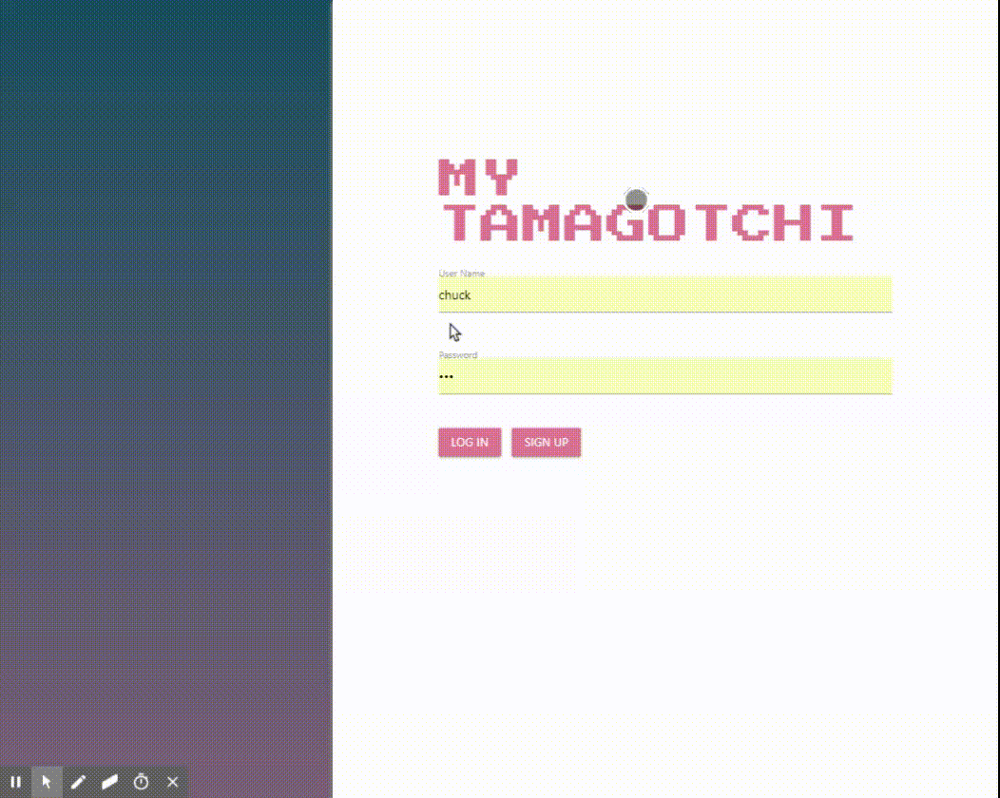

# Tamagotchi
 Tamagotchi is an application that simulates the real "Tamagotchi" that is handheld digital pet. The purpose of this group project is to built a full stack application from scratch.
 Additionally, the other puposes are practice RESTful API, creating a good game logic by using JavaScript, Node.js in the server side, creating,retrieving, and manipulating data using MySQL and Sequelize.

 * You can also reach this app => https://arcane-temple-24813.herokuapp.com

## A View From The App

 

## Technologies Used

* JavaScript
* HTML
* CSS
* Materialize
* Node.js
* Node Packages => mysql2, moment, passport, bcrypt-nodejs etc.
* MySQL
* express.js
* Sequelize

